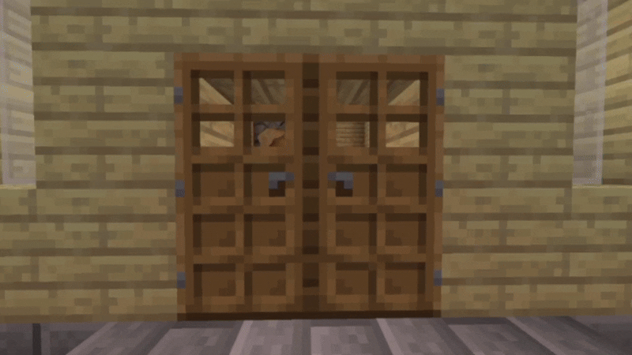

# TwinDoors

Automatically opens double doors placed handle-to-handle.

## Preview

## Features
- Works with all wooden doors
- Works with copper doors
- Server-side required
- Fabric 1.21.10

## Installation
1. Install Fabric Loader
2. Install Fabric API
3. Put the mod into mods folder

## License
MIT

